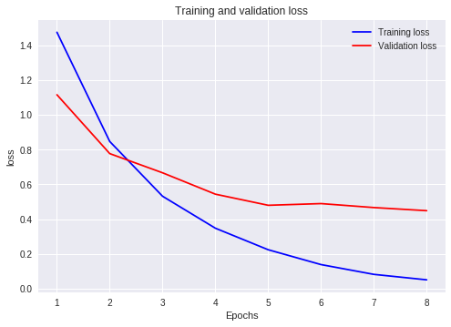
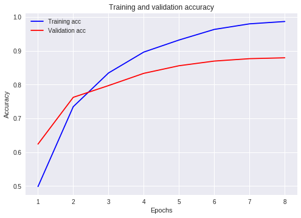
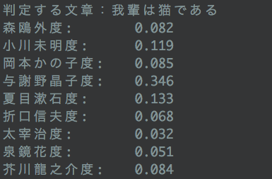

# BungoClassifier

入力文の文体が、どの文豪の文体に近いか判定します。


- 対応している文豪
  - 森鴎外、小川未明、岡本かの子、与謝野晶子、夏目漱石、折口信夫、太宰治、泉鏡花、芥川龍之介

# Requirements
## To Predict
- NumPy
- TensorFlow
- Keras
- Gensim
- mecab-python3

If you use the AMD GPU:
- PlaidML

## To Train
- NumPy
- Pandas
- TensorFlow
- Keras
- Gensim
- regex
- mecab-python3
- tqdm

If you use the AMD GPU:
- PlaidML

# How to Predict


実行に必要なファイルは
[こちら](https://drive.google.com/drive/folders/1fdCYkxeKj0u56W8wtB0DeUof0c0SntAV?usp=sharing)からダウンロードできます。

`data`ディレクトリを作成し、上記のリンクからダウンロードできる`pre_trained_mode.h5`、`bungo_dict.txt`を保存してください。

`main.py`を実行すれば冒頭のデモのように推論を行う事ができます。

```
$ python3 main.py
```

もしAMDのGPUを使っている場合は、`main.py`の先頭に以下の2行を加えてください。

```
import plaidml.keras            # for PlaidML (AMDのGPUを使用している場合に必要)
plaidml.keras.install_backend() # for PlaidML (AMDのGPUを使用している場合に必要)
```

## Notes
- 今回、入力は50単語であるとして訓練を行なったため、推論を行う際はなるべく50単語以上含まれるテキストを使った方が良い精度が出ます。

# How to Train
`青空文庫から作品をダウンロード`->`訓練データ＆テストデータの作成`->`モデルの訓練`

## データセットの作成
データセット作成手順を説明します。

### 作品のダウンロード
- [青空文庫 作家別一括ダウンロード](http://keison.sakura.ne.jp/)

上記のサイトから、好きな文豪の作品をダウンロードし、解凍します。`data/works`ディレクトリを作成し、解凍したフォルダをそれぞれ保存します。

```
$ mkdir -p data/works
```

青空文庫からダウンロードしたファイル名には空白が混じっていることがあります。
[こちら](https://qiita.com/JeJeNeNo/items/49ff685332e8f8222de2)等を参考に、空白を他の文字に置き換えておいてください。

```
$ find ./data/works/*/ -depth -name "* *" -execdir rename 's/ /_/g' "{}" \;
```

### テキストの前処理
ルビ、注釈、ヘッダー、フッターや記号などを削除し、テキストを分かち書きにします。

```
$ python3 pre_processing.py
```

実行すると、`data/(作家名).csv`が作成されます。このCSVファイルは51列あり、はじめの50列には単語が1語ずつ、最後の1列には正解ラベルが書かれています。

### 辞書の作成
各単語に固有のIDを振るための辞書を作ります。

```
$ python3 make_dictionary.py
```

実行すると、`data/bungo_dict.txt`が作成されます。

### 訓練データ＆テストデータの作成

```
$ python3 make_train_test_data.py
```

実行すると、`data/all_data.csv`、`data/train.csv`、`data/test.csv`が作成されます。
これらのCSVファイルは51列あり、はじめの50列の数字は各単語のID、最後の1列の数字は正解ラベルを意味しています。
`data/train.csv`は90,000行、`data/test.csv`は10,000行あります。
`data/train.csv`を用いて訓練、`data/test.csv`を用いて評価を行います。


## モデルの訓練
[`pred_author.ipynb`](https://github.com/9sako6/BungoClassifier/blob/master/pred_author.ipynb)を参考にしてください。モデルの訓練にはGPUが必要です。
ちなみに、筆者は[Google Colab](https://colab.research.google.com/)で訓練を行いました。
無料でGPUを使えるのでとてもよいです（2018/10/29現在）。

- Google Colabを用いるためには、Googleアカウントが必要です。

- Google Colabを用いて訓練を行う場合は、`data/train.csv`、`data/test.csv`、`data/bungo_dict.txt`をGoogle Colab上にアップロードする必要があります。


訓練が完了すると、`pre_trained_model.h5`が作成されます。これを`data`ディレクトリ内に保存します。このファイルは学習済みのモデルの重みを記録したものです。実行時にはこの重みを使い、推論を行います。


### 結果
以下のような結果になりました。






最終的に、validation accuracyは約87.7%となりました。

テストデータにおける評価では正解率87.9%となりました。


# 課題

## 入力文が短い場合に精度が低い
実際に推論を行なってみて気づいたことですが、入力文が短いと精度が悪いです。たとえ「吾輩は猫である」を入力したとしても、夏目漱石に近いと判定できません。



この原因は、入力文が50単語だと決め打って訓練を行なったことだと考えられます。
50単語だと決め打ったのは、「文」の定義が難しかったからです。

例えば

> 「僕はそんな事は考えない。」不精々々に木村が答えた。

のような場合、`「僕はそんな事は考えない。」`と`不精々々に木村が答えた。`をそれぞれ1文とするか、`「僕はそんな事は考えない。」不精々々に木村が答えた。`を1文とするか、結構悩ましいです。
このあたりのことをあまり考えたくなかったので、入力は1文ではなく50単語、と決めて訓練をしました。


さらに今回、入力文が50単語に満たない場合は空の文字列を表すIDを割り当ててリサイズしました。
問題だと思われるのは、未知語に対しても同じIDを割り当ててしまっていることです。
入力文が短い場合に精度が悪くなる一因になっている気がします。
kerasの`Embedding(mask_zero=True)`などを使えばゼロパディングしてくれるようなので、この辺をうまく使いたいです。

## データサイズのばらつき
作品数は作家ごとにかなり異なっています。
訓練データ、テストデータを作成する際はそこを考慮しませんでした。
データの数を均等にして訓練すると精度が上がるかどうか検証したいです。

# 参考
- [LSTMを使ってテキストの多クラス分類をする](https://blog.codingecho.com/2018/03/25/lstm%E3%82%92%E4%BD%BF%E3%81%A3%E3%81%A6%E3%83%86%E3%82%AD%E3%82%B9%E3%83%88%E3%81%AE%E5%A4%9A%E3%82%AF%E3%83%A9%E3%82%B9%E5%88%86%E9%A1%9E%E3%82%92%E3%81%99%E3%82%8B/)

- [PythonとKerasによるディープラーニング. Francois Chollet (著), 巣籠悠輔（翻訳）, 株式会社クイープ（翻訳）. マイナビ出版 (2018/5/28). pp.78-86 ](https://www.amazon.co.jp/Python%E3%81%A8Keras%E3%81%AB%E3%82%88%E3%82%8B%E3%83%87%E3%82%A3%E3%83%BC%E3%83%97%E3%83%A9%E3%83%BC%E3%83%8B%E3%83%B3%E3%82%B0-Francois-Chollet-ebook/dp/B07D498RJK)
