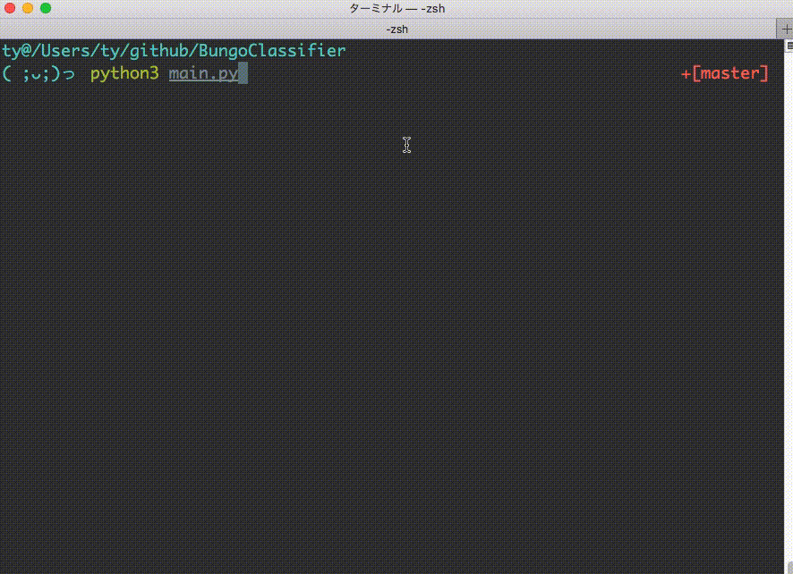

# BungoClassifier

入力文の文体が、どの文豪の文体に近いか判定します。



- 対応している文豪
  - 夏目漱石、芥川龍之介、森鴎外、太宰治

# Requirements
## To Predict
- NumPy
- TensorFlow
- Keras
- Gensim
- mecab-python3

If you use the AMD GPU:
- PlaidML

## To Train
- NumPy
- Pandas
- TensorFlow
- Keras
- Gensim
- regex

# How to Predict

```
$ python3 main.py
```

# How to Train
Comming soon...

## データセットの作成
訓練を行う上で最も厄介なのがデータセット(`data/train.csv`, `data/test.csv`)の作成です。
夏目漱石、芥川龍之介、森鴎外、太宰治の場合を例にしてその手順を説明します。

### 作品のダウンロード
- [青空文庫 作家別一括ダウンロード](http://keison.sakura.ne.jp/)

上記のサイトから、夏目漱石、芥川龍之介、森鴎外、太宰治の作品をダウンロードします。
ダウンロードしたzipファイルを解凍します。`data`ディレクトリを作成し、解凍したフォルダをそれぞれ`natsume`, `akutagawa`, `mori`, `dazai`という名前で保存します。

### テキストの前処理

```
$ python3 pre_processing.py
```

実行すると、`data/natsume.csv`、`data/akutagawa.csv`、`data/mori.csv`、`data/dazai.csv`が作成されます。

# 参考
- [LSTMを使ってテキストの多クラス分類をする](https://blog.codingecho.com/2018/03/25/lstm%E3%82%92%E4%BD%BF%E3%81%A3%E3%81%A6%E3%83%86%E3%82%AD%E3%82%B9%E3%83%88%E3%81%AE%E5%A4%9A%E3%82%AF%E3%83%A9%E3%82%B9%E5%88%86%E9%A1%9E%E3%82%92%E3%81%99%E3%82%8B/)

- [PythonとKerasによるディープラーニング. Francois Chollet (著), 巣籠悠輔（翻訳）, 株式会社クイープ（翻訳）. マイナビ出版 (2018/5/28). pp.78-86 ](https://www.amazon.co.jp/Python%E3%81%A8Keras%E3%81%AB%E3%82%88%E3%82%8B%E3%83%87%E3%82%A3%E3%83%BC%E3%83%97%E3%83%A9%E3%83%BC%E3%83%8B%E3%83%B3%E3%82%B0-Francois-Chollet-ebook/dp/B07D498RJK)
